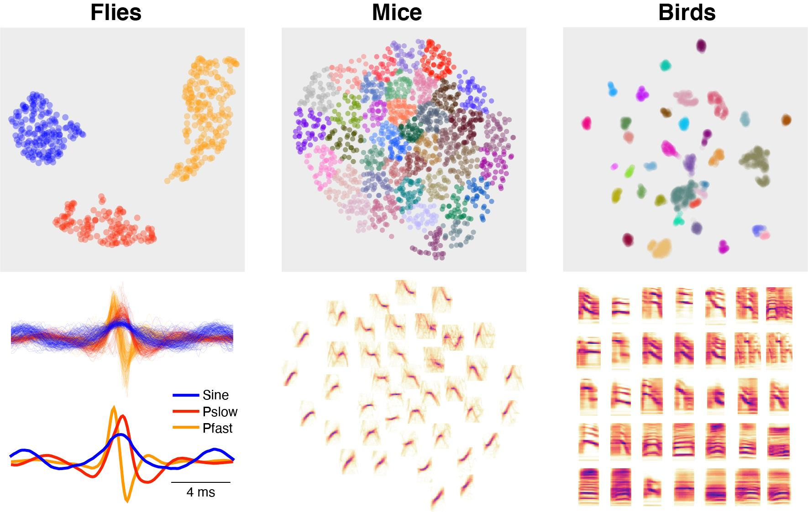

# Tools for unsupervised classification of acoustic signals
_DeepSS-unsupervised_ provides tools for pre-processing acoustic signals for unsupervised classification:

- extract waveforms or spectrograms of acoustic events from a recording
- normalize the duration, center frequency, amplitude, or sign of waveform/spectrograms

Unsupervised classification itself is performed using existing libraries:

- dimensionality reduction: [umap](https://umap-learn.readthedocs.io/)
- clustering: [hdbscan](https://hdbscan.readthedocs.io/) or [scikit-learn](https://scikit-learn.org/stable/modules/clustering.html)

Can be Used in combination with [DeepSS](https://github.com/janclemenslab/deepsongsegmenter), a deep learning based method for the supervised annotation of acoustic signals.


## Installation

```shell
pip install deepss-unsupervised
```

## Demos
 Illustration of the workflow and the method using vocalizations from:

- [flies](demo/flies.ipynb)
- [mice](demo/mice.ipynb)
- [birds](demo/birds.ipynb)




## Acknowledgements
Code from the following open source packages was modified and integrated into dss-unsupervised:

- [avgn](https://github.com/timsainb/avgn_paper)[^1]
- [noisereduce](https://pypi.org/project/noisereduce)
- [fly pulse classifier](https://github.com/murthylab/MurthyLab_FlySongSegmenter)[^2]


## References

[^1]: T Sainburg, M Thielk, TQ Gentner: Latent space visualization, characterization, and generation of diverse vocal communication signals. Biorxiv. [https://doi.org/10.1101/870311]()

[^2]: J Clemens, P Coen, F Roemschied, T Perreira, D Mazumder, D Aldorando, D Pacheco, M Murthy: Discovery of a New Song Mode in Drosophila Reveals Hidden Structure in the Sensory and Neural Drivers of Behavior. Current Biology 28, 2400–2412.e6 (2018). [https://doi.org/10.1016/j.cub.2018.06.011]()